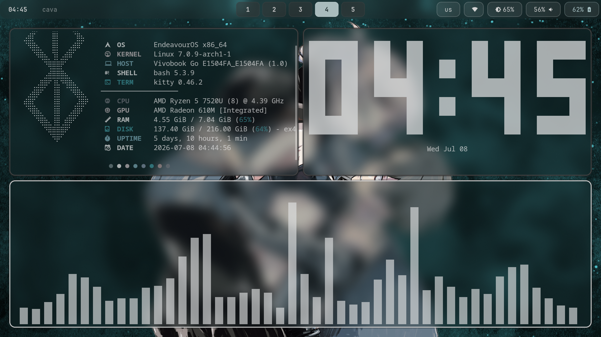
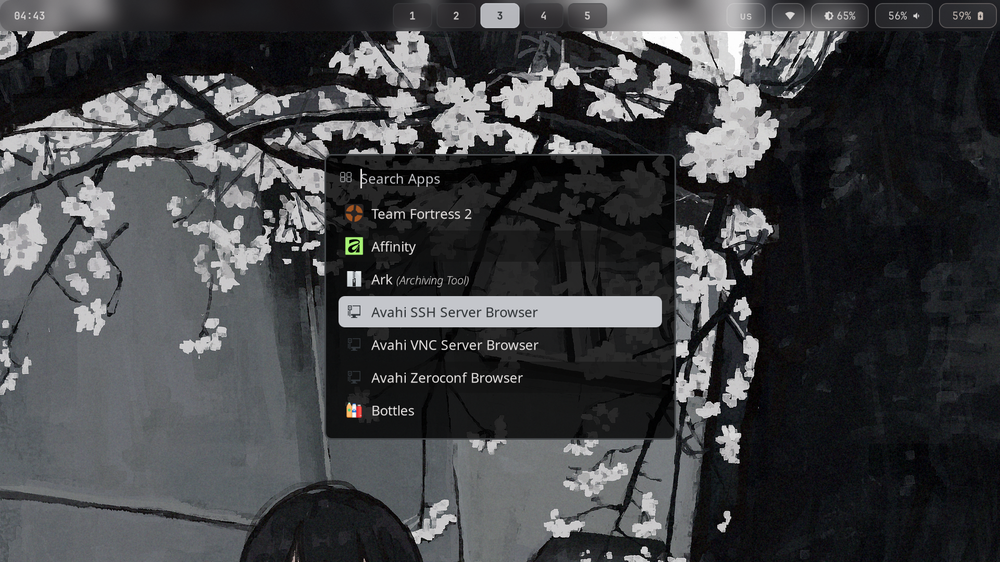
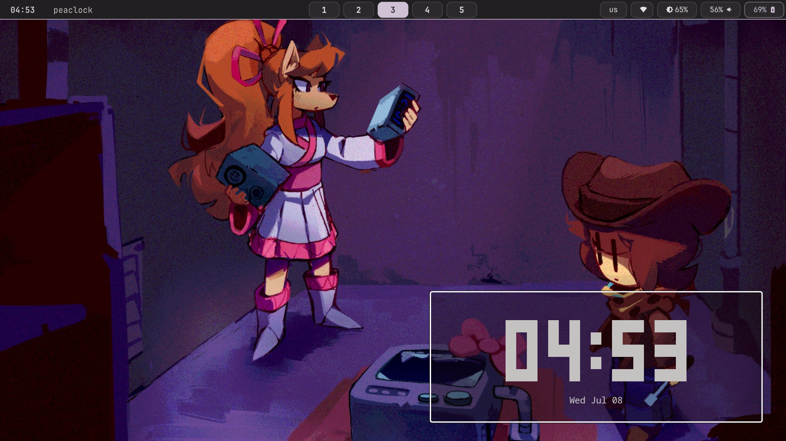

# Fleziz-dots

My personal Hyprland rice — dark glassmorphism aesthetic, custom rofi launcher (with calculator + emoji picker built in), mako notifications, waybar, and hyprlock.

> **⚠️ Work in progress** — this rice is actively evolving. Some things may be half-finished, keybinds may shift, and configs will keep changing as I tweak things. Use at your own risk, and feel free to open an issue if something's broken.

## Screenshots





## Install

```bash
git clone https://github.com/pywellsdm/fleziz-dots.git
cd fleziz-dots
./install.sh
```

The script installs required packages (pacman + AUR via yay), backs up any existing configs you already have, and symlinks everything into place.

### Not automated — install manually if you want the exact look

- **Font:** JetBrainsMono Nerd Font (used in mako, waybar, rofi)
- **Cursor theme:** GoogleDot-Black
- **File manager:** Dolphin (bound to `Super + E`)
- **Browser:** Zen Browser via Flatpak (bound to `Super + B`)

## Keybinds

| Keybind | Action |
|---|---|
| `Super + Q` | Open terminal (kitty) |
| `Super + C` | Close active window |
| `Super + M` | Power menu / logout |
| `Super + E` | File manager (Dolphin) |
| `Super + V` | Toggle floating |
| `Super + R` | waybar refresh (i needed that during waybar ricing) |
| `Super + P` | Toggle pseudotile |
| `Super + J` | Toggle split direction |
| `Super + D` | Rofi drun (app search) |
| `Super + T` | Rofi calculator |
| `Super + I` | Rofi emoji picker |
| `Super + Shift + L` | Hide/show waybar |
| `Super + B` | Zen Browser |
| `Super + F` | Fullscreen |
| `Super + Z` | Lock screen (hyprlock) |
| `Super + S` | Screenshot (full) |
| `Super + Shift + S` | Screenshot (area select) |
| `Super + W` | Random wallpaper |
| `Super + Shift + W` | Wallpaper picker |
| `Super + Shift + K` | Toggle glass theme |
| `Super + Shift + J` | Toggle rounded/square window borders |
| `Super + O` | Toggle OLED mode |
| `Super + [1-0]` | Switch workspace |
| `Super + Shift + [1-0]` | Move window to workspace |
| `Super + arrow keys` | Move focus |
| `Super + \`` | Scratchpad toggle |

## Credits

Built on Hyprland, waybar, rofi, mako, hyprlock, waypaper, and matugen.
